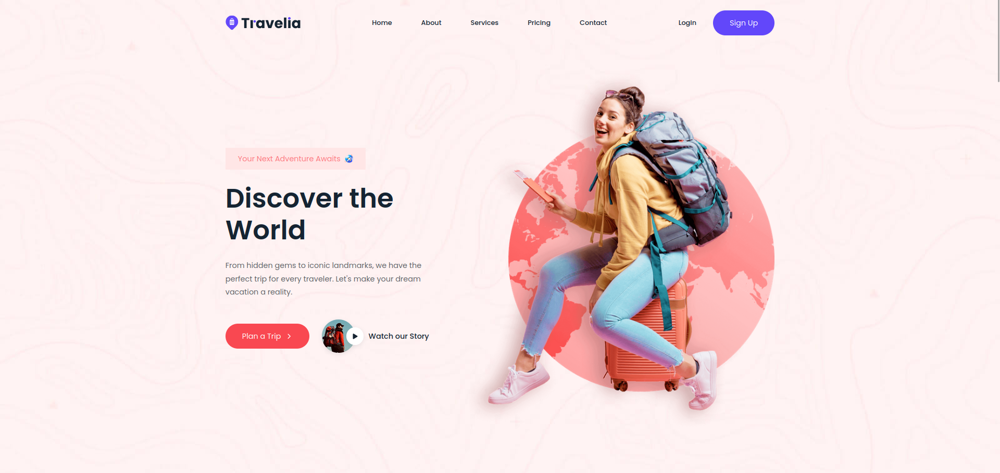
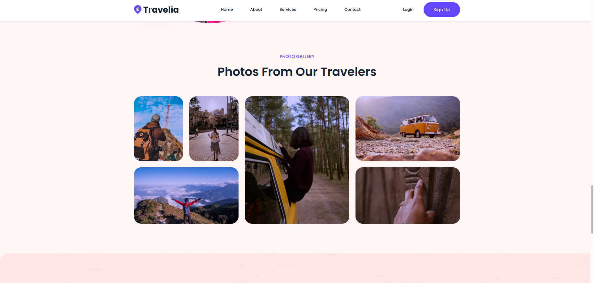
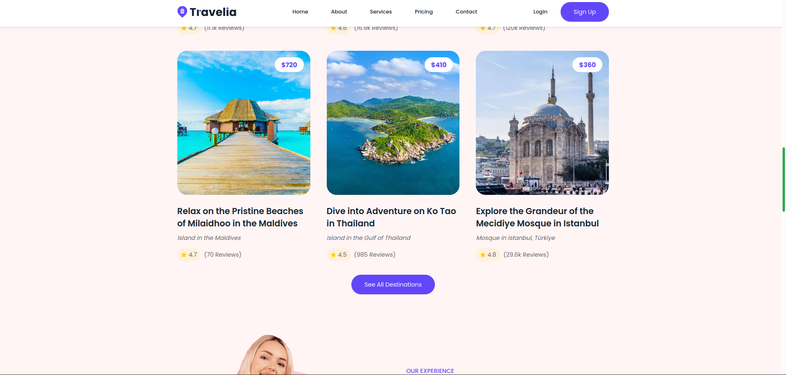
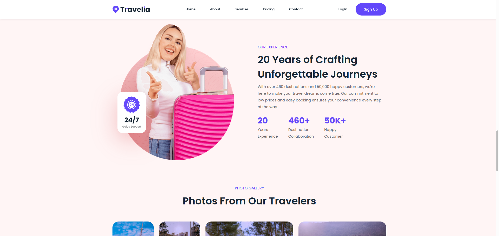
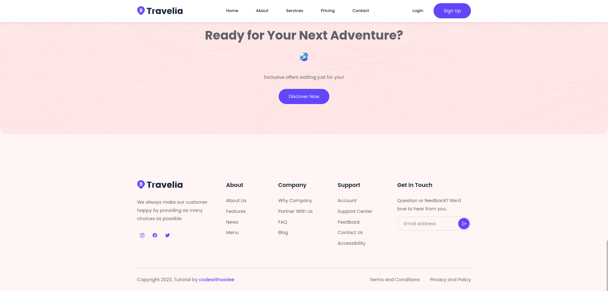

# Travel Website 

This is a responsive travel website built as a learning exercise using **HTML**, **CSS**, and **JavaScript**.  
learning core front-end development skills while focusing on clean, scalable, and accessible design principles.  

## Overview  

Developed as a local test site to get familiar with modern web development techniques.  
Features a visually appealing layout with multiple sections, including featured destinations, reviews, and calls-to-action.  
The site follows best practices for responsive design, ensuring a seamless experience across desktops, tablets, and mobile devices.  

## Features

During the development, several important technical concepts and skills were applied:  

- **Sticky Navigation**  
  Ensures consistent access to the menu as users scroll through content, improving usability.  

- **Advanced CSS Grid and Flexbox**  
  Used to create adaptive layouts, complex section arrangements, and a responsive masonry-style gallery.  

- **CSS Custom Properties**  
  Implemented reusable variables for colors, spacing, and typography to maintain consistency and simplify updates.  

- **Aspect Ratio Preservation**  
  Maintains image proportions across different screen sizes, preventing layout shifts.  

- **Masonry Layout Techniques**  
  Built a visually appealing, grid-based card system for showcasing travel destinations.  

- **Fully Responsive Design**  
  Achieved optimal readability and usability for all screen sizes without sacrificing aesthetics.  

## What Was Learned  

- Proficiency in semantic HTML structure.  
- Strong understanding of modern CSS layout systems (Grid, Flexbox).  
- Optimizing for responsiveness and accessibility.  
- Modularity with CSS via custom properties for maintainability.  
- Capability to translate a design into a functional, well-organized UI.  

# Screenshots  

  
  
  
  
 

# Credits
  - Tutorial: Based on a YouTube tutorial by [codewithsadee](https://www.youtube.com/watch?v=VA8cgdMpNf4).
  - Fonts: Google Fonts (Poppins).
  - Icons: Ionicons (v5.5.2).

 
This project serves as a technical demonstration and portfolio example, showcasing front-end development practices and design implementation.
